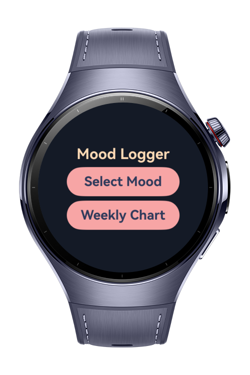
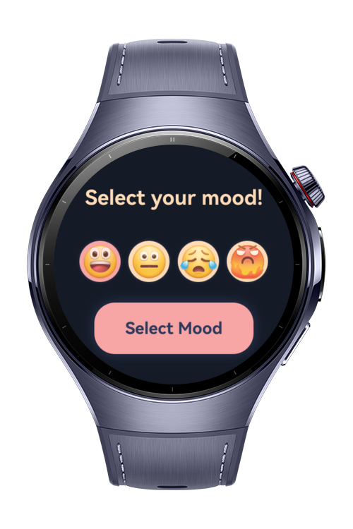
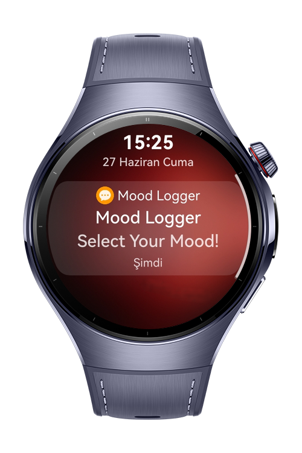

> **Note:** To access all shared projects, get information about environment setup, and view other guides, please visit [Explore-In-HMOS-Wearable Index](https://github.com/Explore-In-HMOS-Wearable/hmos-index).

# Mood Logger

**Mood Logger** is a lightweight ArkTS app designed for HarmonyOS Next watches. It lets you log your daily mood with
emoji-based options, review the past week’s mood history, and set quick reminder timers that send a notification when
time is up. Built for simplicity, it helps you track emotional patterns and manage small tasks directly from your wrist.

# Preview

<div>
  
  
  
  
</div>

# Use Cases

- **Daily Mood Logging:** Record your mood once a day using emoji-based options for quick self-tracking.
- **Weekly Mood Review:** Check your past 7 days of entries through the built-in mood chart to spot trends.
- **Smart Reminders:** Set a short timer with a custom title and get notified right on your wrist when it’s done.
- **Reliable Data Storage:** All moods and timers are saved locally with `distributedKVStore`, ensuring your data stays
  available.
- **Works Anywhere:** Log moods and set timers even without internet access — the app is fully offline-ready.

# Tech Stack

- **Languages**: ArkTS, Typescript
- **Frameworks**: HarmonyOS SDK 5.1.0(18)
- **Tools**: DevEco Studio Version 5.1.0.828
- **Libraries**:
    - `@kit.AbilityKit`
    - `@kit.ArkData`
    - `@kit.ArkUI`
    - `@kit.BackgroundTasksKit`
    - `@kit.BasicServicesKit`
    - `@kit.NotificationKit`
    - `@kit.PerformanceAnalysisKit`

# Directory Structure

```
entry/src/main/ets/
|---common
|   |---KvStoreManager.ets      // Singleton manager for distributed KV storage
|---entryability
|   |---EntryAbility.ets        // Main UI entry ability
|---entrybackupability
|   |---EntryBackupAbility.ets  // Background ability (for alarms/reminders)
|---pages
|   |---ChartPage.ets           // Weekly mood chart display
|   |---Index.ets               // Home screen with routing to other pages
|   |---MoodPage.ets            // Mood selection and save logic
|---utils
|   |---Logger.ets              // Simple log utility
|---resources
|   |---string.json             // Localized app strings

```

# Constraints and Restrictions

## Supported Devices

- Huawei Watch 5

# License

**Mood Logger** is distributed under the terms of the MIT License.
See the [license](/LICENSE) for more information.